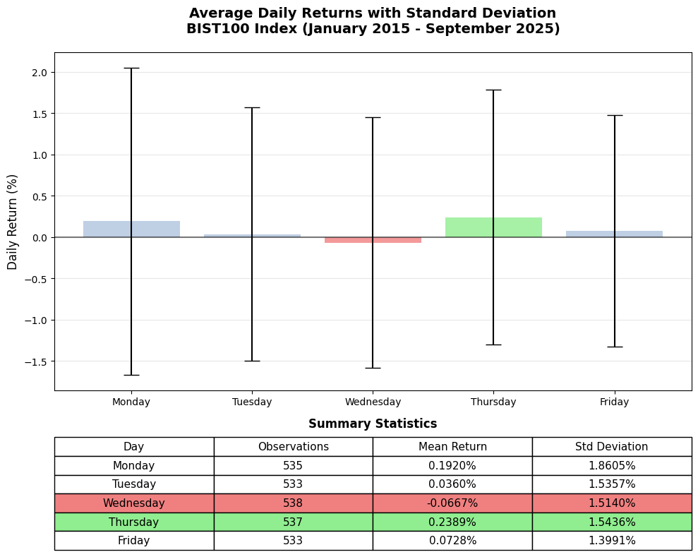

# **Analysis of calendar Anomalies in the BIST100 Index (2015-2025)**

##  Summary

This project examines calendar anomalies in the Turkish stock market through rigorous statistical analysis of the BIST100 index. calendar anomalies are systematic, calendar-based return patterns that challenge the Efficient Market Hypothesis by suggesting predictable deviations from market efficiency.

Using over a decade of data (January 2015 - September 2025), this study tests for two key anomalies: day-of-the-week effects and month-of-the-year effects. The analysis determines whether BIST100 returns exhibit statistically significant temporal variations, providing empirical evidence on market efficiency in emerging markets.

## Dataset Overview

- **Index:** BIST100
- **Period:** January 2, 2015 - September 3, 2025
- **Source:** Investing.com historical data
- **Variables:** Date, Price, Open, High, Low, Volume, Change %
- **Data Access:** Manual download (no API available), also available in [`/data`](/data) folder

### Sample Distribution
- **Daily Analysis:** 2,676 observations across weekdays (533-538 per day)
- **Monthly Analysis:** 130 observations across months (10-11 per month)

The balanced sample sizes across both weekdays and months support robust statistical comparisons within each analysis framework.

## Methodology

### Return Calculation
Daily and monthly continuous returns (log returns) were calculated using the standard formula:

$R_t = \ln\left(\frac{P_t}{P_{t-1}}\right)$ where $P_t$ represents the closing price at time $t$. 
Continuous returns provide time-additive and symmetric measures essential for rigorous financial analysis. 

### Hypotheses

**Day-of-the-Week Effect:**
- $H_0$: μ_Monday = μ_Tuesday = μ_Wednesday = μ_Thursday = μ_Friday
- $H_1$: At least one weekday mean differs

**Month-of-the-Year Effect:**
- $H_0$: μ_Jan = μ_Feb = ... = μ_Dec  
- $H_1$: At least one monthly mean differs

### Analytical Approach

#### Day-of-the-Week Effect Analysis
Preliminary assumption testing revealed significant departures from ANOVA requirements:
- **Normality:** Shapiro-Wilk tests rejected normality for all weekdays (p < 0.05)
- **Homogeneity:** Levene's test confirmed unequal variances (p = 1.50 × 10⁻⁶)

Given these violations, **Welch's ANOVA** was employed as the primary test, followed by **Games-Howell** and **Tamhane's T2** post-hoc procedures for pairwise comparisons.

#### Month-of-the-Year Effect Analysis
Assumption testing for monthly data showed:
- **Normality:** Violated only for July (p = 0.0339)
- **Homogeneity:** Satisfied across all months (p = 0.3776)

The homogeneous variances and ANOVA's robustness to minor normality violations supported the use of **standard one-way ANOVA**.

---

*For comprehensive statistical outputs and detailed results, see [`test results`](/test_results.md)

---

## Conclusion

### **Day-of-the-Week Effect**
**Statistical Significance:** Welch's ANOVA detected significant differences across weekdays (F = 3.2664, p = 0.011219). 
Post-hoc analyses revealed this effect was driven exclusively by the **Thursday-Wednesday** comparison (Games-Howell p = 0.009568, Tamhane's T2 p = 0.005418).

**Practical Significance:** Despite statistical detection, the effect size (η² = 0.0048) indicates the day-of-the-week-effect patterns explain less than 0.5% of return variance.

### **Month-of-the-Year Effect**
**No Statistical Evidence:** Standard ANOVA found no significant differences across calendar months (F = 1.1105, p = 0.359359). This result indicates an absence of a month-of-the-year effect in BIST100 returns during the 2015-2025 period.

### **Overall Assessment**

These findings contribute to the broader literature on market efficiency and calendar anomalies in emerging markets. The minimal explanatory power of detected day-of-the-week effects, combined with the complete absence of monthly patterns, suggests that calendar anomaly patterns are either non-existent or too small for meaningful exploitation in the BIST100 returns during 2015-2025.

---
## Disclaimer

This analysis is for academic and informational purposes only. This analysis is for academic and informational purposes only. It does not constitute or intend to provide financial or investment advice.

---

**Reading Recommendation:** Rossi, M. (2015). The Efficient Market Hypothesis and Calendar Anomalies: A Literature Review. *International Journal of Managerial and Financial Accounting, 7*(3/4), 285–296. https://doi.org/10.1504/IJMFA.2015.074913

---
## License
This project is licensed under the [MIT License](LICENSE).
